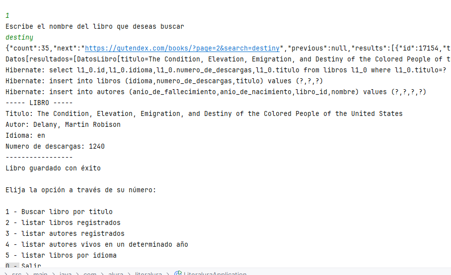
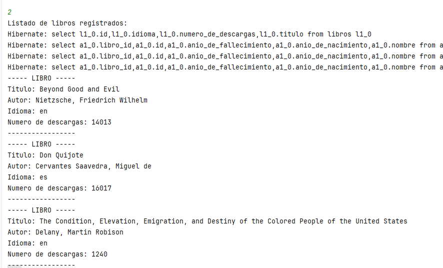
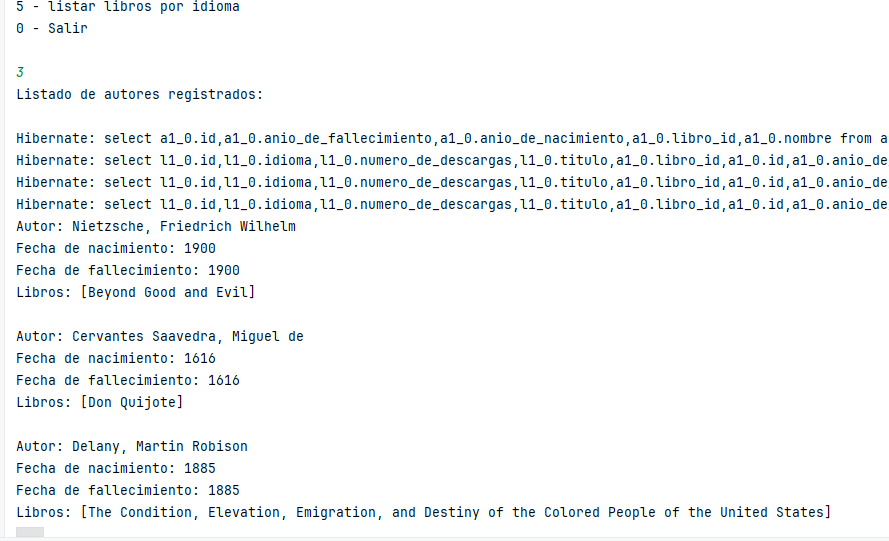
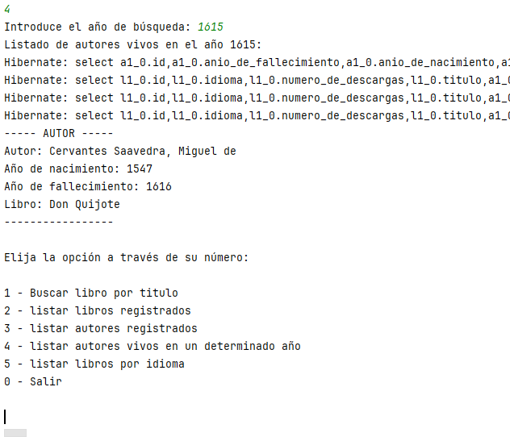
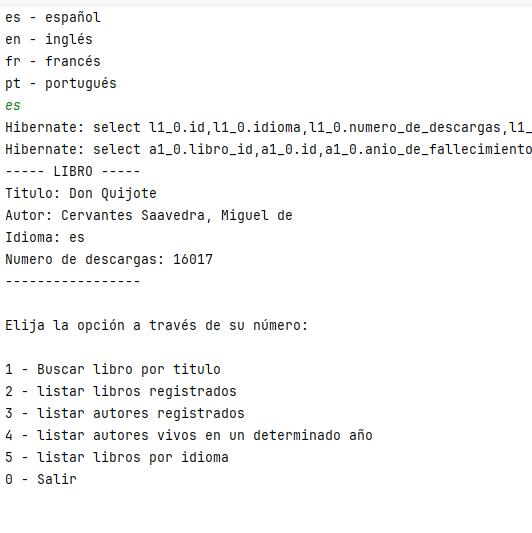

# Desafío Literalura     

## Desarrollador Raúl Humberto Díaz Fernández
### Java v17 - Spring Boot
### Java JPA
### PostgreSQL

Buscando y agregando un libro a la base de datos

Listando los libros registrados

Listando los autores registrados

Listando los autores vivos en un año determinado

Listando los libros por idioma

## Clase DatosAutor

Representa los datos obtenidos de una fuente externa sobre un autor, como una API.

####  Campos

nombre: El nombre del autor.
anioDeNacimiento: El año de nacimiento del autor.
anioDeFallecimiento: El año de fallecimiento del autor.
Uso

Esta clase se utiliza para deserializar los datos obtenidos de una fuente externa sobre un autor, como una API. Contiene los datos básicos del autor, como su nombre, año de nacimiento y año de fallecimiento.

Nota

La anotación @JsonIgnoreProperties(ignoreUnknown = true) se utiliza para ignorar cualquier propiedad desconocida en el JSON que se deserializa, lo que evita errores de deserialización.

## Clase DatosLibro

Representa los datos obtenidos de una fuente externa sobre un libro, como una API.

Campos

titulo: El título del libro.
autores: La lista de autores del libro.
idiomas: La lista de idiomas en los que está disponible el libro.
numeroDeDescargas: El número de descargas del libro.
Uso

Esta clase se utiliza para deserializar los datos obtenidos de una fuente externa sobre un libro, como una API. Contiene los datos básicos del libro, como su título, autores, idiomas y número de descargas.

Nota

La anotación @JsonIgnoreProperties(ignoreUnknown = true) se utiliza para ignorar cualquier propiedad desconocida en el JSON que se deserializa, lo que evita errores de deserialización.

## Clase DatosLibroResponse

Representa la respuesta obtenida de una fuente externa que contiene información sobre libros, como una API.

Campos

count: El número total de libros en la respuesta.
resultados: La lista de libros en la respuesta, representados mediante objetos DatosLibro.
Uso

Esta clase se utiliza para deserializar la respuesta obtenida de una fuente externa que contiene información sobre libros. Contiene el número total de libros y la lista de libros en la respuesta.

Nota

La anotación @JsonIgnoreProperties(ignoreUnknown = true) se utiliza para ignorar cualquier propiedad desconocida en el JSON que se deserializa, lo que evita errores de deserialización.

## Clase Libro

Representa un libro con sus datos básicos.

Campos

id: El identificador único del libro.
titulo: El título del libro.
autores: La lista de autores del libro.
idioma: El idioma del libro.
numeroDeDescargas: El número de descargas del libro.
Uso

Esta clase se utiliza para representar un libro en la aplicación. Contiene los datos básicos del libro, como su título, autores, idioma y número de descargas.

Nota

La clase Libro tiene una relación con la clase Autor a través de la anotación @OneToMany, lo que significa que un libro puede tener varios autores.

Constructores

La clase Libro tiene dos constructores:

Un constructor vacío que se utiliza para crear un objeto Libro sin inicializar sus campos.
Un constructor que toma un objeto DatosLibro como parámetro y se utiliza para crear un objeto Libro a partir de los datos obtenidos de una fuente externa.
Métodos

La clase Libro tiene varios métodos que se utilizan para obtener y establecer los valores de sus campos.

## Clase Principal

Esta clase es la clase principal de la aplicación. Contiene el menú principal y los métodos para interactuar con la base de datos.

Métodos

muestraElMenu: Muestra el menú principal de la aplicación.
buscarLibroPorTitulo: Busca un libro por título y lo muestra en pantalla.
listarLibrosRegistrados: Lista todos los libros registrados en la base de datos.
listarAutoresRegistrados: Lista todos los autores registrados en la base de datos.
listarAutoresVivosEnUnAnio: Lista todos los autores vivos en un año determinado.
listarLibrosPorIdioma: Lista todos los libros registrados en un idioma determinado.
Uso

La clase Principal se utiliza para interactuar con la base de datos y mostrar la información de los libros y autores en pantalla.

Nota

La clase Principal utiliza las clases Libro y Autor para interactuar con la base de datos.

## Interface AutorRepository

Esta interfaz extiende de JpaRepository y define los métodos de búsqueda y almacenamiento de autores en la base de datos.

Métodos

findByAnioDeFallecimientoGreaterThanEqualOrAnioDeFallecimientoIsNull: Busca autores vivos en un año determinado.
Uso

La interfaz AutorRepository se utiliza para interactuar con la base de datos y obtener información de autores.

Nota

La interfaz AutorRepository utiliza la clase Autor para interactuar con la base de datos.

## Interface LibroRepository

Esta interfaz extiende de JpaRepository y define los métodos de búsqueda y almacenamiento de libros en la base de datos.

Métodos

findByTituloContainsIgnoreCase: Busca un libro por título, ignorando mayúsculas y minúsculas.
findByIdioma: Busca libros por idioma.
Uso

La interfaz LibroRepository se utiliza para interactuar con la base de datos y obtener información de libros.

Nota

La interfaz LibroRepository utiliza la clase Libro para interactuar con la base de datos.

ConsumoAPI

Esta clase se encarga de consumir la API de libros y obtener los datos en formato JSON.

Métodos

obtenerDatos: Envía una solicitud GET a la URL proporcionada y devuelve la respuesta en formato JSON.
Uso

La clase ConsumoAPI se utiliza para obtener datos de la API de libros y procesarlos en la aplicación.

Nota

La clase ConsumoAPI utiliza la clase HttpClient para enviar la solicitud GET y obtener la respuesta.

Dependencias

java.net.http.HttpClient
java.net.http.HttpRequest
java.net.http.HttpResponse

## Clase ConvierteDatos

Esta clase se encarga de convertir los datos obtenidos de la API en objetos de la aplicación.

Métodos

obtenerDatos: Convierte un string JSON en un objeto de la clase especificada.
Uso

La clase ConvierteDatos se utiliza para convertir los datos obtenidos de la API en objetos de la aplicación, como Libro o DatosLibroResponse.

Nota

La clase ConvierteDatos utiliza la biblioteca Jackson para convertir los datos JSON en objetos.

Dependencias

com.fasterxml.jackson.core.ObjectMapper
com.fasterxml.jackson.core.JsonProcessingException
Interfaz

La clase ConvierteDatos implementa la interfaz IConvierteDatos, que define el método obtenerDatos.

## Interface IConvierteDatos

Esta interfaz define el contrato para convertir datos JSON en objetos de la aplicación.

Métodos

obtenerDatos: Convierte un string JSON en un objeto de la clase especificada.
Uso

La interfaz IConvierteDatos se utiliza para definir el comportamiento de las clases que se encargan de convertir datos JSON en objetos de la aplicación.

Nota

La interfaz IConvierteDatos es implementada por la clase ConvierteDatos, que proporciona la implementación concreta para convertir datos JSON en objetos.

## Clase LibroService

Esta clase es un servicio que se encarga de gestionar los libros en la aplicación. Proporciona métodos para obtener, guardar y eliminar libros.

Métodos

obtenerTodosLosLibros: Obtiene todos los libros registrados en la base de datos.
obtenerLibroPorId: Obtiene un libro por su ID.
guardarLibro: Guarda un libro en la base de datos.
eliminarLibro: Elimina un libro de la base de datos.
Uso

La clase LibroService se utiliza para interactuar con la base de datos y realizar operaciones CRUD (Crear, Leer, Actualizar, Eliminar) en los libros.

Nota

La clase LibroService utiliza la interfaz LibroRepository para interactuar con la base de datos.

Dependencias

org.springframework.beans.factory.annotation.Autowired
org.springframework.stereotype.Service
org.springframework.dao.DataIntegrityViolationException
Excepciones

La clase LibroService maneja excepciones de integridad de datos en caso de errores al guardar o eliminar libros.

## Clase LiteraluraApplication

Esta clase es la aplicación principal de la aplicación Literalura. Se encarga de inicializar la aplicación y ejecutar el menú principal.

Métodos

main: Método principal de la aplicación que inicia la ejecución de la aplicación.
run: Método que se ejecuta después de la inicialización de la aplicación y que muestra el menú principal.
Uso

La clase LiteraluraApplication se utiliza para iniciar la aplicación y ejecutar el menú principal.

Nota

La clase LiteraluraApplication utiliza la anotación @SpringBootApplication para indicar que es una aplicación Spring Boot.

Dependencias

org.springframework.boot.CommandLineRunner
org.springframework.boot.SpringApplication
org.springframework.boot.autoconfigure.SpringBootApplication
Inyección de dependencias

La clase LiteraluraApplication utiliza la anotación @Autowired para inyectar las dependencias de los repositorios LibroRepository y AutorRepository.

Ejecución del menú principal

La clase LiteraluraApplication crea una instancia de la clase Principal y llama al método muestraElMenu para mostrar el menú principal de la aplicación.